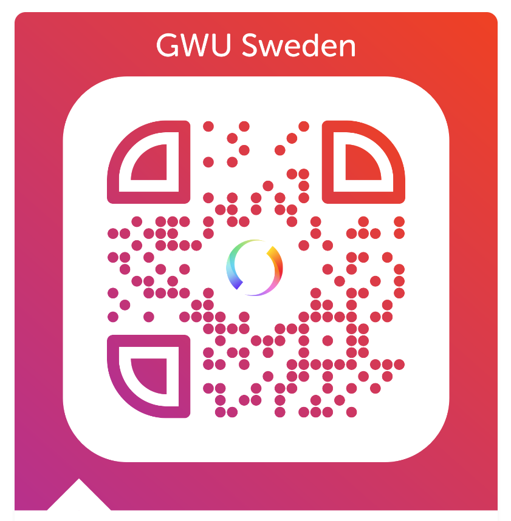

Welcome to GWU Sweden, a local chapter of <a href="https://www.gameworkersunite.org/">Game Workers Unite</a>.

We're a horizontal organization of people dedicated to advocating for workers' rights in the Swedish games industry. We are not a union, but we are their friends.

Right now we're just starting up and if you want to get involved please <a href="/join.html">join us</a> and become a part of the cause. 🎮

We have running costs for having a bank account as well as this web page.
If you are willing to donate it would help the organisation a lot.
Small donations help.

Swish:
123 49 262 67

